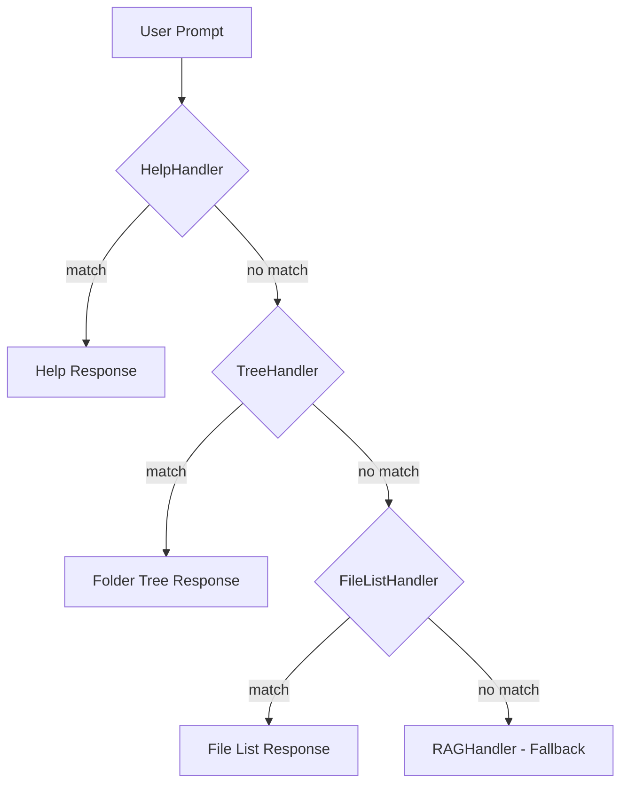

# 시스템 아키텍처 문서 (Architecture Document)

## 1. 개요 (Overview)

본 문서는 "나만의 AI 비서 (My-Brain)" 프로젝트의 전체 시스템 구조와 모듈 간의 상호작용을 정의합니다.
시스템은 **Monorepo** 구조를 따르며, **FastAPI 백엔드**와 **Next.js 프론트엔드**로 구성됩니다. 로컬 AI 모델(Ollama)과 RAG 엔진을 활용하여 개인 데이터를 처리합니다.

## 2. 디렉토리 구조 (Directory Structure)

```
/zime-ai-model/
├── apps/
│   ├── web/                     # [Frontend] Next.js Application
│   │   ├── src/app/             # App Router 페이지
│   │   ├── src/api/             # Backend 통신 클라이언트
│   │   └── src/components/      # React 컴포넌트
│   └── server/                  # [Backend] FastAPI Application
│       ├── main.py              # App Entry Point (lifespan 관리)
│       ├── bundle_main.py       # macOS App Bundle 진입점
│       ├── api/                 # API 라우터
│       │   ├── routes.py        # 라우터 통합
│       │   ├── chat.py          # 채팅 API
│       │   ├── rag.py           # RAG 검색 API
│       │   ├── work.py          # 업무 로그/평가 API
│       │   ├── health.py        # 헬스체크 API
│       │   └── system.py        # 시스템 관리 API
│       ├── core/                # 설정 및 공통 유틸리티
│       │   ├── config.py        # 환경변수 설정 (pydantic-settings)
│       │   ├── logging.py       # 구조화 로깅 (JSON/텍스트)
│       │   ├── middleware.py    # 요청 타이밍 미들웨어
│       │   └── error_handler.py # 에러 핸들링
│       └── services/            # 비즈니스 로직
│           ├── llm/             # LLM 서비스 (핸들러 패턴)
│           │   ├── service.py   # LLMService 클래스
│           │   └── handlers/    # 요청 핸들러
│           │       ├── base.py  # BaseHandler (ABC)
│           │       ├── rag.py   # RAG 폴백 핸들러
│           │       ├── help.py  # 도움말 핸들러
│           │       ├── folder_tree.py  # 폴더 구조 핸들러
│           │       └── file_list.py    # 파일 목록 핸들러
│           ├── rag.py           # SimpleRAGEngine (인메모리 검색)
│           ├── ingest.py        # 파일 수집 및 처리 (Watchdog)
│           └── evaluation.py    # 성과 평가 서비스
├── data/                        # [Data] 사용자 데이터 저장소
│   ├── company/
│   ├── personal/
│   ├── project/
│   └── .vector_db/              # ChromaDB 데이터 저장 경로 (선택적)
└── scripts/                     # [Scripts] 유틸리티 및 실행 스크립트
```

## 3. 시스템 구성 요소 (Components)

### 3.1. 백엔드 (Backend - Python/FastAPI)

- **API Server:** 프론트엔드 요청 처리 및 데이터 제공.

- **Ingestion Engine (수집기):**
  - `Watchdog`을 사용하여 `data/` 폴더 하위의 파일 변경 사항 감지.
  - 파일 타입별(Text, Markdown, Image) 처리기 분리.
  - 이미지의 경우 Vision 모델(qwen2.5vl:7b)을 통해 설명 생성.

- **RAG Engine (검색기):**
  - **SimpleRAGEngine**: 인메모리 키워드 기반 검색 (기본값)
  - ChromaDB 사용 시 벡터 임베딩 검색 지원 (USE_CHROMADB=True)

- **LLM Service (핸들러 패턴):**
  - Chain of Responsibility 패턴을 사용하여 프롬프트 처리.
  - Ollama API와 통신하여 검색된 문맥(Context)을 바탕으로 답변 생성.

- **Evaluation Service:**
  - 업무 로그 기반 성과 평가 생성.

### 3.2. LLM 핸들러 아키텍처

LLM 서비스는 Chain of Responsibility 패턴을 사용하여 프롬프트를 처리합니다:



| Handler | 키워드 | 기능 |
|---------|--------|------|
| HelpHandler | 도움말, 사용법 | 사용 가이드 제공 |
| TreeHandler | 트리, 폴더 구조 | 폴더 구조 표시/이미지 생성 |
| FileListHandler | 목록, 리스트 | 인덱싱된 파일 목록 |
| RAGHandler | (fallback) | 문서 검색 및 응답 |

### 3.3. 프론트엔드 (Frontend - Next.js)

- **Dashboard:** 인덱싱 상태, 최근 작업 문서, 시스템 리소스 현황 시각화.
- **Chat Interface:** 실시간 스트리밍 답변 표시, 이전 대화 내역 조회.
- **History:** 채팅 히스토리 관리.
- **Settings:** 시스템 설정 관리.

### 3.4. 데이터 흐름 (Data Flow)

1. **데이터 수집:** 사용자 파일 저장 -> `Ingestion Engine` 감지 -> 텍스트 추출 -> `RAG Engine` 저장.
2. **질의 응답:** 사용자 질문(Web) -> API 호출 -> `LLM Service` 핸들러 체인 -> 적절한 핸들러가 처리 -> Ollama 생성 -> 답변 반환.

## 4. API 엔드포인트

| 메서드 | 엔드포인트 | 설명 |
|--------|-----------|------|
| POST | /api/v1/chat | AI 채팅 |
| POST | /api/v1/search | RAG 문서 검색 |
| POST | /api/v1/work/logs | 업무 로그 생성 |
| GET | /api/v1/work/logs | 업무 로그 목록 |
| GET | /api/v1/work/logs/{date} | 특정 날짜 로그 |
| GET | /api/v1/work/evaluation/summary | 성과 평가 |
| POST | /api/v1/system/reload | 데이터 리로드 |
| GET | /health | 상세 헬스체크 |
| GET | /health/live | Liveness 프로브 |
| GET | /health/ready | Readiness 프로브 |

## 5. 모듈화 전략 (Modularization)

- **Service Layer Pattern:** API 라우터와 비즈니스 로직(Service)을 명확히 분리하여 테스트 용이성 확보.
- **Handler Pattern:** LLM 요청 처리를 핸들러 체인으로 분리하여 확장성 확보.
- **Interface Driven:** LLM이나 RAG 엔진 교체가 용이하도록 추상화된 인터페이스 사용.
