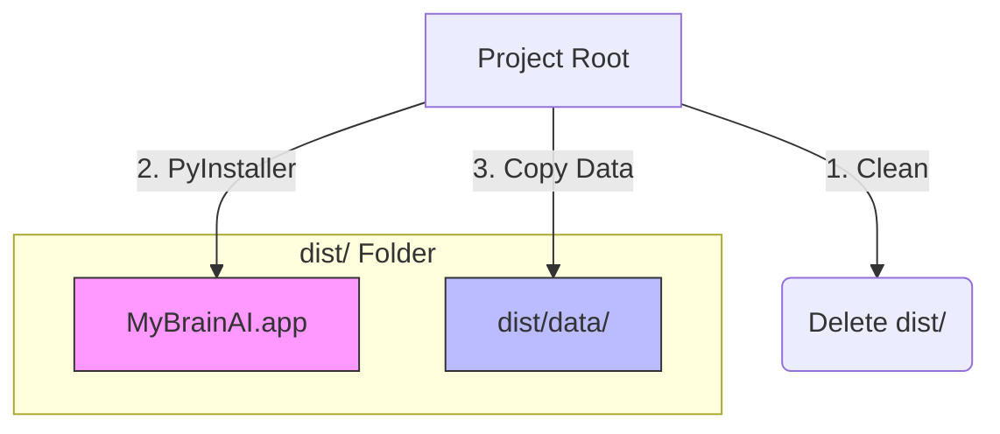
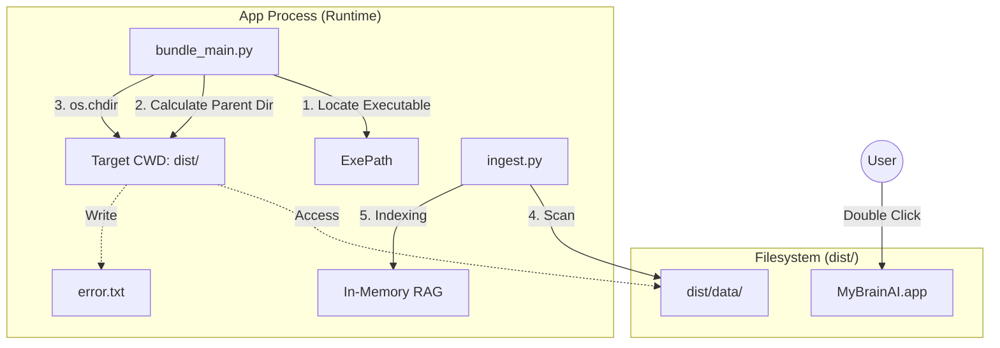

# Data Persistence Architecture & Flow

이 문서는 `MyBrainAI`의 데이터 보존 및 로딩 구조가 어떻게 동작하는지 설명합니다.

## 핵심 컨셉

- **Code & Logic**: `.app` 번들 내부에 영구적으로 패키징 (Read-Only).
- **User Data**: `.app` 번들 외부(`dist/data`)에 위치하여 수정 가능 (Read-Write).
- **Build Process**: 빌드 시 프로젝트 루트의 `data` 폴더를 `dist/data`로 복사하여 "초기 데이터"로 제공.

---

## 1. Build Phase (빌드 단계)

`scripts/build_mac.sh`가 실행될 때의 흐름입니다.

1. **Clean**: 기존 `dist` 폴더를 삭제하여 깨끗한 상태로 시작합니다.
2. **Build**: PyInstaller가 코드를 `.app`으로 패키징합니다. 이 단계에서는 `data` 폴더를 포함하지 않습니다(가볍게 유지).
3. **Copy**: 프로젝트 루트(`zime-ai-model/data`)에 있는 원본 데이터를 `dist/data`로 복사합니다.

---

## 2. Execution Phase (실행 단계)

사용자가 `MyBrainAI.app`을 실행할 때의 흐름입니다.

### 상세 로직 (`bundle_main.py`)

1. **위치 파악**: 앱이 실행되면 자신의 위치(`.../MyBrainAI.app/Contents/MacOS/MyBrainAI`)를 파악합니다.
2. **경로 계산**: 실행 파일 경로에서 3단계 상위 폴더(`../../..`)인 `dist` 폴더를 찾습니다.
3. **CWD 변경**: 작업 디렉토리(Current Working Directory)를 `dist`로 변경합니다.
4. **데이터 접근**: 이제 앱은 `./data` 경로를 통해 `dist/data` 폴더에 접근할 수 있습니다.
5. **학습(Index)**: `ingest.py`가 `./data` 폴더를 스캔하여 모든 문서를 메모리에 로드합니다.

## 요약

| 구분 | 위치 | 설명 |
|---|---|---|
| **실행 파일** | `dist/MyBrainAI.app` | 변경 불가능한 프로그램 본체 |
| **데이터 폴더** | `dist/data` | 사용자가 파일을 추가/수정하는 곳 |
| **로그 파일** | `dist/error.txt` | 실행 로그가 저장되는 곳 |

이 구조 덕분에 **앱을 재빌드해도 `data` 폴더를 백업했다가 다시 넣어줄 필요 없이**, 프로젝트 루트의 `data` 폴더만 관리하면 자동으로 배포본(`dist`)에 반영됩니다.
